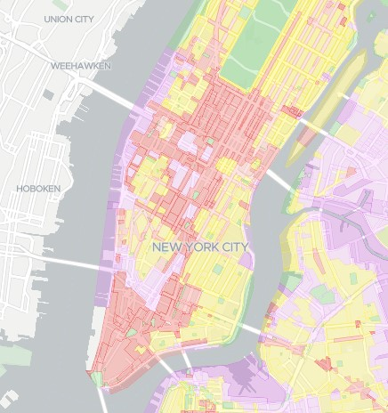
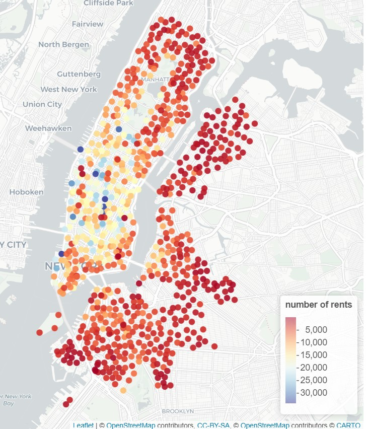

```{r setup, include=FALSE}
knitr::opts_chunk$set(echo = TRUE)
# source("raport-helpers.R")
```

## Abstrakt

Za pomocą danych o użyciu rowerów miejskich w nowym jorku, spróbujemy ustalić, które dzielnice nowego jorku są mieszkalne, a które biznesowe - w których pracują ludzie.

W tym celu porównamy, czy w godzinach, o których najczęściej rozpoczyna się i kończy praca w nowym jorku można zauważyć różnice, w jakich rejonach rowery są częściej wypożyczane.

## Opis poszukiwań

### Początek

Analizę rozpocząłem od sprawdzenia, czy w Nowym Jorku istnieje podział na różne rodzaje dzielnic - np. podobnie jak w innych większych miastach. Okazuje się, że tak.

Na poniższej stronie możemy znaleźć wizualizację rodzajów dzielnic: [podział dzielnic](https://zola.planning.nyc.gov/?layer-groups=%5B%22street-centerlines%22%2C%22zoning-districts%22%5D&selectedZoning=%5B%22C1%22%2C%22C2%22%2C%22C3%22%2C%22C4%22%2C%22C5%22%2C%22C6%22%2C%22C7%22%2C%22C8%22%2C%22M1%22%2C%22M2%22%2C%22M3%22%2C%22PA%22%2C%22R1%22%2C%22R10%22%2C%22R2%22%2C%22R3%22%2C%22R4%22%2C%22R5%22%2C%22R6%22%2C%22R7%22%2C%22R8%22%2C%22R9%22%5D){.uri}



obszary zaznaczone na żółto oznaczają dzielnice mieszkalne, na brązowo zaznaczone są dzielnice biznesowe.

Przykładowe dzielnice mieszkaniowe to: **East Village** oraz **Upper West Side.** Do dzielnic biznesowych należą między innymi: **Midtown** i **Financial District - Lower Manhattan.**

Według danych ze strony: <https://fivethirtyeight.com/features/which-cities-sleep-in-and-which-get-to-work-early/> nowojorczycy zaczynają pracę najcześciej w godzinach od 7:30 do 9:30. Wynika z tego, że wyruszają do pracy prawdopodobnie w przedziale od godziny 7:00 do 9:00.

Jeżeli chodzi o zakończenie pracy, przyjąłem, że nowojorczycy kończą pracę od 15:30 do 17:30 - czyli dojeżdżają do domu w okolicach 16:00 do 18:00.

### Mapa stacji

Aby odnaleźć odpowiedź na pytanie postawione w hipotezie posługiwałem się ramkami danych pobranymi ze strony: <https://s3.amazonaws.com/tripdata/index.html>

Początkowo korzystałem z danych dotyczących całego roku 2019, ale ostatecznie aby przyspieszyć wykonywane obliczenia zrezygnowałem z nadmiarowych danych - skupiłem się na danych z kwietnia, maja oraz czerwca, gdyż okazało się że są one dosyć reprezentatywne.

Wybór padł na rok 2019, gdyż ramki z tego roku mają dostatecznie dużo rekordów, ale dane nie zostały zniekształcone przez pandemię lub inne wydarzenia.

Początkowo wykonałem wizualizację liczby wypożyczeń na każdej ze stacji:



Przedstawiony wyżej obrazek pochodzi z przygotowanej przeze mnie interaktywnej aplikacji w Shiny, która pozwalała łatwo analizować dane - przygotowana przez mnie aplikacja pozwala na filtrowanie danych ze względu na datę oraz godzinę wyjazdów. Co więcej umożliwia pokazywanie oddzielnie odjazdów ze stacji oraz przyjazdów do stacji.

Niestety jak widać, tego rodzaju wizualizacja nie umożliwia na zobaczenie zbyt wiele - kropki oznaczające stacje zlewają się ze sobą i nie pozwalają na wyciągniecie sensownych wniosków.

### Mapa ciepła

Aby lepiej zwizuwalizować dane przygotowałem interaktywną mapę ciepła. Poniżej znajdują się mapy odjazdów nad ranem oraz przyjazdów nad ranem.


O ile na powyższych obrazkach da się zauważyć różnice między umiejscowieniem kolorów - bardziej niebieska (czyli więcej przyjazdów) zdaje się być dzielnica Midtown oraz Finacial District. Na drugim obrazku intensywniej zaznaczona zdaje się być m.in. dzielnica East Village oraz West Village, wciąż cieżko stwierdzić które dzielnice są mieszkalne, a które biznesowe.

Należało więc zwizualizować dane w inny - lepszy sposób.

### Kartogram

Aby lepiej zwizualizować trendy w poszczególnych dzielnicach idealnym rozwiązaniem zdawał się kartogram - każda dzielnica zaznaczona na kolor reprezentujący, np. liczbę wypożyczeń.

W związku z tym korzystając z danych pochodzących z otwartego serwisu [BetaNYC](data.beta.nyc) przyporządkowałem stacje do odpowiednich dzielnic. Podobnie jak w poprzednich przykładach wykonałem interaktywną mapę - kartogram w Shiny.

{width="580"}

{width="580"}

{width="580"}

{width="580"}

Na powyższych mapach widać już znacznie więcej - np. dzielnica **East Village** jest wyraźnie ciemniejsza jeżeli chodzi o wyjazdy rano oraz przyjazdy wieczorem. Podobnie dzielnica **Upper West Side** najwyraźniej jest mieszkaniowa. Dzielnice **Finacial District** oraz **Midtown** również zachowują się zgodnie z przewidywaniami.

Mimo to, na powyższej mapie ciężko poszukiwać definitywnej odpowiedzi na to, czy widać zależności.

Wobec tego ostatecznie zdecydowałem się na zaprezentowanie danych na wykresach.

### Wykresy przyjazdów do dzielnic

```{fig.show()}
```
