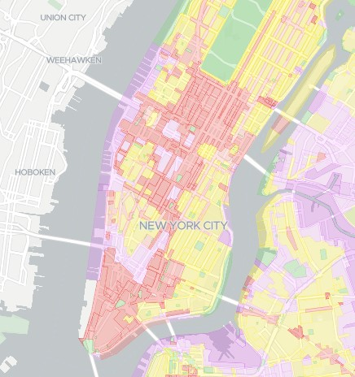

```{r setup, include=FALSE}
knitr::opts_chunk$set(echo = TRUE)
```

## Abstract

Za pomocą danych o użyciu rowerów miejskich w nowym jorku, spróbujemy ustalić, które dzielnice nowego jorku są mieszkalne, a w których pracują ludzie.

W tym celu porównamy, czy w godzinach, o których najczęściej rozpoczyna się i kończy praca w nowym jorku można zauważyć różnice, w jakich rejonach rowery są częściej wypożyczane

dane bedziemy sobie porównywac z tym tu: <https://zola.planning.nyc.gov/?layer-groups=%5B%22street-centerlines%22%2C%22zoning-districts%22%5D&selectedZoning=%5B%22C1%22%2C%22C2%22%2C%22C3%22%2C%22C4%22%2C%22C5%22%2C%22C6%22%2C%22C7%22%2C%22C8%22%2C%22M1%22%2C%22M2%22%2C%22M3%22%2C%22PA%22%2C%22R1%22%2C%22R10%22%2C%22R2%22%2C%22R3%22%2C%22R4%22%2C%22R5%22%2C%22R6%22%2C%22R7%22%2C%22R8%22%2C%22R9%22%5D>



```{r cars}
summary(cars)
```

## dalej

You can also embed plots, for example:

```{r pressure, echo=FALSE}
plot(pressure)
```

Note that the `echo = FALSE` parameter was added to the code chunk to prevent printing of the R code that generated the plot.
